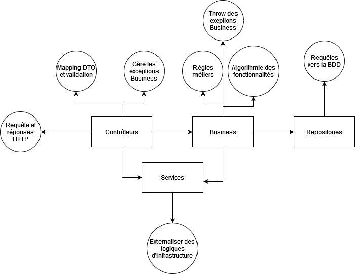

# SpringInn

Projet de gestion d'hôtel avec des chambres et des réservations.

## Concepts abordés
* Docker / Conteneurisation
* Couche Business

## Conteneur de déploiement
* [Dockerfile](Dockerfile) qui définit un stage de build qui permet de générer le jar du projet ainsi qu'un stage d'exécution qui utilise ce jar pour lancer l'application (utiliser des stages permet de réduire la taille finale de l'image docker)

* [docker-compose.yml](docker-compose.yml) qui charge le Dockerfile, expose les ports et va également définir un autre service/conteneur pour la base de données (ici mariadb)

```yml
services:
  # définition du service java/spring
  app:
    # qui build en utilisant le fichier Dockerfile situé à la racine
    build: .
    # expose sur le port 8080 de notre machine le port 8080 du conteneur
    ports:
      - 8080:8080
    # On inidique que ce conteneur dépend du service/conteneur database et que celui ci soit considéré comme "healthy"
    depends_on:
      database:  
        condition: service_healthy
  # définition du service mariadb
  database:
    image: mariadb:lts
    environment:
      - MARIADB_DATABASE=springinn #le nom de la base de donnée créée dans le conteneur
      - MARIADB_USER=dev #le nom du user mariadb qui se connectera à la bdd
      - MARIADB_PASSWORD=1234 #son mot de passe
      - MARIADB_RANDOM_ROOT_PASSWORD=true #on génère un mot de passe random pour le root (on pourrait aussi le laisser vide)

    #on définit un healthcheck qui permettra à l'autre conteneur de savoir quand celui ci est prêt
    healthcheck:
      test: ["CMD", "healthcheck.sh", "--connect", "--innodb_initialized"] #le healthcheck inclut dans l'image mariadb
      start_period: 10s #au bout de combien de temps on commence à vérifier s'il tourne
      interval: 10s #le temps entre chaque check
      timeout: 5s #au bout de combien de temps on considère que le test n'est pas passé
      retries: 3 #le nombre d'essais pour voir si le service marche
```


Dans le [application.properties](src/main/resources/application.properties) on vient définir notre lien de connexion à la base de données en prenant en compte que ce sera exécuté dans le conteneur, on vient donc indiqué le host du conteneur mariadb comme cible de connexion et les informations qu'on a indiqué dans les variables d'environnement

```
spring.datasource.url=jdbc:mariadb://database:3306/springinn?user=dev&password=1234
```

Pour lancer l'application, on utilise `docker compose up`

### Conteneur de développement
Dans ce projet, on utilise l'extension et la spécification devcontainer de Microsoft (également disponible sur IntelliJ). Cet outil permet de créer un conteneur de développement dans lequel sera ouver l'IDE et qui permettra de développer directement à l'intérieur du conteneur, éliminant ainsi le besoin d'avoir l'environnement d'exécution et de dév installé sur sa machine, juste Docker est suffisant.

Pour le mettre en place, on crée un dossier [.devcontainer](.devcontainer) avec un fichier [devcontainer.json](.devcontainer/devcontainer.json) et un fichier [docker-compose-dev.yml](.devcontainer/docker-compose-dev.yml)

Techniquement on pourrait n'avoir que le fichier devcontainer.json et venir y décrire le conteneur à créer pour le développement, on peut y spécifier les images à utiliser, les ports à exposer etc.

Dans notre cas, on est parti pour réutiliser une partie de notre environnement décrit dans le docker-compose.yml original dont on redéfini certaines partie avec le docker-compose-dev.yml

Dans notre devcontainer.json, on vient donc indiquer qu'on charge les deux fichiers yml (attention à l'ordre, on charge le dev après l'original) et qu'on vient lancer VsCode dans le conteneur/service "app"

`devcontainer.json`
```json

{
  //Le nom du conteneur à créer
	"name": "SpringInn DevContainer",
  //Les fichier docker compose qui serviront pour la création du conteneur
	"dockerComposeFile": [
		"../docker-compose.yml",
		"docker-compose-dev.yml"
	],

  //Le service/conteneur définit dans les docker-compose auquel on veut connecter vscode
	"service": "app",
  //le dossier du conteneur dans lequel on viendra positionner vscode, ici le nom du dossier qu'on expose au conteneur dans le docker-compose
	"workspaceFolder": "/app"

}

```


`docker-compose-dev.yml`
```yml
services:
 
  app:
    # on redéfinit le build pour ne pas utiliser notre DockerFile
    build: !reset null
    # à la place on part sur une image java
    image: eclipse-temurin:25-jdk
    #on expose notre code source dans le conteneur sous le dossier /app
    volumes:
      - .:/app
    #on execute une commande pour que le conteneur ne se ferme pas automatiquement
    command: sleep infinity
```

On peut également personnaliser le conteneur pour y installer certaines extensions vscode ou features : 


```json

{
  //...reste de la config

	"features": {
		"ghcr.io/davzucky/devcontainers-features-wolfi/bash:1": {}, //installe /bin/bash dans le conteneur
		"ghcr.io/devcontainers/features/git:1": { //install git dans le conteneur
			"ppa": true,
			"version": "system"
		}
		
	},

	
	"customizations": {
		"vscode": {
      //Installe les extensions java, spring et un client mysql
			"extensions": [
				"vscjava.vscode-java-pack",
				"cweijan.vscode-mysql-client2",
				"vmware.vscode-boot-dev-pack"
			]
		}
	}
}
```
## Entités

```plantuml

class Room {
    id:string
    number:string
    capacity:int
    price:double
}

class Booking {
    id:string
    startDate:LocalDate
    duration:int
    total:double
    guestCount:int
}

class User {
    id:string
    email:string
    password:string
    role:string
}
class Customer extends User {
    address:string
    name:string
    firstname:string
    phoneNumber:string
}


Room "*" -- "*" Booking
Booking "*" -- "1" Customer


```

Nous avons donc un User qui servira pour les admins et les clients. Les clients sont représentés par la classe Customer qui hérite de User qui pourra avoir plusieurs réservations, ces réservations peuvent contenir une ou plusieurs chambres. On répète le total du prix dans la réservation pour prendre en compte les changements de prix futur des chambres. On utilisera le startDate et la duration des réservations pour déterminer quelles chambres sont libres ou non.

## Architecture


On part ici sur une architecture n-tiers dans laquelle on fait en sorte de bien séparer les différentes responsabilités: 
* Les Entités et les Repositories ne s'occupent que de la persistence des données
* Le Business utilise les repositories, certains services et les entités et contiendra le gros de l'algorithmie pour les différentes fonctionnalités de l'application, c'est dans cette couche que seront les règles métiers notamment
* Les Services contiennent de l'algorithmie propre à l'infrastructure comme l'envoie de mail, la génération et validation de Tokens si on fait des JWT, etc.
* Les Contrôleurs définissent les routes et les DTO d'entrée et de Sortie, se chargent du mapping et ne font appel qu'au business ou à certains services. Ils ne contiennent quasiment aucune algorithmie
* On fait en sorte de définir des interfaces pour les Business et Service afin d'avoir les différentes couches qui dépendront d'abstractions plutôt que d'implémentation.


## Spring Boot

### Gestion globale des exceptions
Spring boot en Web va catch automatiquement les RuntimeException qui ne sont pas catchées mais produira des erreurs HTTP 500.
Comme notre Business throw des exceptions business lors de certains traitements, on va vouloir faire en sorte de catch ces exceptions dans la couche contrôleur afin de renvoyer les codes et messages d'erreurs pertinents.

Première solution simple, mais qui alourdira beaucoup les contrôleurs : faire des try catch dans chaque méthode et y gérer l'exception :

```java
    @PostMapping
    @ResponseStatus(HttpStatus.CREATED)
    public DisplayRoomDTO add(@RequestBody @Valid CreateRoomDTO room) {
      try {
        
        return mapper.toDisplay(
            roomBusiness.createRoom(mapper.toEntity(room))
        );
      } catch (RoomNumberUnavaibleException e) {
        throw new ResponseStatusExcpetion(HttpStatus.BAD_REQUEST, e.getMessage());
      }
        
    }
```

Ça fonctionne, mais on va se retrouver à pas mal se répéter, notamment pour les NOT_FOUND.

Spring Boot permet donc de créer des Controller Advice, qui sont des classes décorées avec une annotation spéciale qui permettront de définir des exception handlers : un comportement généralisée à avoir face à une exception ou une autre.

Niveau organisation de ces handlers, on a le choix, on peut faire plusieurs classe ControllerAdvice selon les types d'exceptions ou d'entité par exemple, ou bien un ControllerAdvice pour tout le business comme ci dessous dans lequel on fait une méthode de handling par exception, il est également possible de regrouper plusieurs exceptions ensembles si elles ont un parent commun et résultat d'erreur similaire. (et enfin, on peut même techniquement faire un seul handler pour la classe parent qui ensuite fera des conditions pour définir l'erreur à renvoyer mais pour le coup, ça peut être un peu sale)

```java
@RestControllerAdvice
public class BusinessExceptionController {

    @ExceptionHandler(RoomNumberUnavaibleException.class)
    public ProblemDetail roomNumberUnavailable(RoomNumberUnavaibleException exception) {
        return ProblemDetail
        .forStatusAndDetail(HttpStatus.BAD_REQUEST, exception.getMessage());
    }

    @ExceptionHandler(NoSuchElementException.class)
    public ProblemDetail ressourcenotFound() {
        return ProblemDetail
        .forStatusAndDetail(HttpStatus.NOT_FOUND, "Ressource could not be found");
    }
}
```


### Envoi de mail
Pour envoyer des mails depuis notre application, il faut avoir un serveur de mail configuré. Plein d'options possibles pour en obtenir un, soit en passant par ceux fournis par les fournisseurs de mail gmail/outlook/etc. soit souscire à un serveur de mail spécifique, on peut parfois même en avoir un avec son FAI, ou bien via son hebergeur. On peut également self-host le serveur SMTP, il faudra alors installer un serveur de mail sur un serveur/dans un conteneur juste avoir un nom de domaine pour le lier à notre serveur.

Dans l'absolu, l'application n'a même pas trop à savoir d'où vient ce serveur SMTP, elle doit juste avoir les information de connexion à celui ci (le port, le host et souvent le username/password) à spécifier dans le application.properties :

```
spring.mail.host=???
spring.mail.username=???
spring.mail.password=???
spring.mail.port=???
```

Dans le contexte du développement, on part sur un conteneur docker fournissant un serveur SMTP de développement qu'on a configuré dans le [docker-compose-dev.yml](.devcontainer/docker-compose-dev.yml)

```yml
#on définit le service/conteneur 
  mailserver:
    image: maildev/maildev #on utilise l'image maildev, ce n'est pas la seule qui fournit ce genre de service
    environment:
      - MAILDEV_SMTP_PORT=1025 #on indique le port SMTP que le serveur de mail écoutera
    ports:
     - 1080:1080 #on expose le port 1080 sur notre machine pour avoir accès à l'UI du serveur de mail
 ```

 Côté Java


## Instructions

### Les DTO pour les routes Rooms existantes + mise en place des tests
1. Installer MapStruct dans Maven avec la dépendance + le plugin
2. Créer un ListRoomDTO avec id,number,price et capacity ainsi qu'un CreateRoomDTO avec number,price et capacity, les 3 obligatoires, le price et la capacity positifs. Faire le RoomMapper avec pour l'instant ses deux méthodes.
3. Côté RoomController, venir faire les conversions d'entité à DTO et inversement. Le business ne connait pas les DTO, juste les entités.
4. Créer une classe de test pour le RoomBusinessImpl en mode test unitaire, qui va donc créer un Mock pour le RoomRepository et une instance de RoomBusinessImpl auquel on donne le mock à manger (soit en faisant une instance à la mano, soit en utilisant un @InjectMocks sur la propriété)
5. Par principe, faire un test de getRoomPage qui va juste vérifier que le findAll est appelé une fois (surtout pour voir si les tests passent au final)
6. Faire 2 tests pour le createRoom un dans lequel on indique au mock du repository de renvoyer un optional empty lors de son find et dans lequel on vérifie que save a été appelé, et un dans lequel on dit au mock de renvoyer une valeur et alors il faudra tester qu'on a bien une exception du bon type levée


### Le reste du CRUD pour la Room
1. Mettre à jour l'implémentation du RoomBusiness pour y ajouter les trois méthodes : getOneRoom, deleteRoom, updateRoom
2. Les trois vont appeler le findOne() avec un orElseThrow() (qui est du coup catché et traité dans notre BusinessExceptionController)
3. Pour le getOneRoom, rien de particulier, juste on appel le find avec son orelse
4. Pour le delete, on fait la mếme, mais ensuite on le delete et pareil pour l'update qui va juste refaire la vérification du room number avant d'update
5. Côté contrôleur, on rajoute les 3 méthodes et un UpdateRoomDTO avec les 3 propriétés mais qui peuvent toutes être null ce coup ci
6. On modifie le mapper pour y ajouter le apply et on fait les mapping dans le contrôleur
7. Côté test, soit en unitaire, soit en fonctionnel, soit les deux, on vérifie que nos méthodes se comportent comme il faut en vérifiant si le delete ou le save sont appelés. Et dans la partie fonctionnelle, on peut vérifier les status http selon ce qu'on donne comme url

### Admin des room
#### Affichage des rooms
1. Créer une nouvelle page src/app/admin/room/page.tsx
2. Créer un component src/components/feature/admin/rooms-table.tsx dans lequel on va utiliser la Data Table de Antd pour afficher la liste des room.
3. On vient créer un lib/api/types.ts dans lequel on crée nos types correspondant aux DTO de notre back
4. Créer un lib/api/room-api.ts dans lequel on vient créer une fonction fetchRoomPage où on lance un axios.get vers notre /api/room et qui va donc récupérer un Page<DisplayRoom>
5. Dans le rooms-table.tsx on vient rajouter une Props de type Page<DisplayRoom>
6. Dans le room/page.tsx on fait notre requête fetchRoomPage et on donne le résultat à notre RoomsTable
7. dans le RoomsTable, on vient définir un tableau représentant la définition des columns à afficher : `[{title:'Number', dataIndex:'number', key:'number'},{title:'Capacity', dataIndex:'capacity', key:'capacity'},{title:'Price', dataIndex:'price', key:'price'}]`
8. On donne les columns et les data (la props) au composant Table

#### Ajout d'une room via une modal
1. Dans le room/page.tsx, rajouter le typage PageProps et récupérer les searchParams
2. Dans les searchParams on va récupérer spécifiquement une variable newRoom et dans le template, faire que si elle est truthy on affiche une Modal, sinon on l'affiche pas (la Modal a une propriété open={} qui permet de dire si elle est affichée ou non)
3. Ajouter un NextLink Add Room qui rajoutera newRoom=true dans l'url
4. Créer un nouveau components/features/admin/room-form.tsx qui sera un component client
5. Dans celui ci on fait un formulaire avec react-hook-form qui renverra un CreateRoom
6. On rajoute un postRoom(room:CreateRoom) qui va faire un axios.post<DisplayRoom> 
7. Dans room-form, on appel le postRoom au moment du submit

#### Validation de la disponibilité de la Room Number
1. Côté Spring, modifier la requête du RoomRepository findByNumber pour faire plutôt un un findByNumberOrId avec un @Query au dessus qui ira chercher par number ou id mais avec un seul argument de type String dans la méthode
2. Modifier dans le RoomBusinessImpl là où on avait appelé findByNumber pour le remplacer par la nouvelle méthode (mettre à jour les tests aussi)
3. Dans le 

#### Pagination des rooms
1. Dans le RoomsTable, rajouter la propriété pagination sur la Table en lui donnant les informations de la page là où ça match (donc à priori Table.current c'est Page.number+1, Table.total c'est Page.totalElements, Table.pageSize c'est Page.size)
2. Faire de RoomsTable un component client et sur le onChange on va récupérer les informations de pagination (current et pageSize je crois, mais à vérifier) et on va faire en sorte de les envoyer dans l'url avec un useRouter et avec un push pour envoyer vers /admin/room?page=...&size=...
3. Dans notre fetchRoomPage, on rajoute un argument page et size en string et on rajoute ces informations dans la requête (soit en concaténant dans l'url, soit avec la propriété `query` de axios)
4. Dans le admin/room/page.tsx, on récupère les searchParams page et size avec des valeurs par défaut et on les donne à manger à notre fetchRoomPage

#### Administrer des rooms
1. Dans le RoomsTable, créer une const rowSelection: TableProps<DisplayRoom>['rowSelection'] = {} qu'on vient assigner au rowSelection de la Table dans le template
2. Dans cet objet, on vient lui indiquer 'checkbox' comme type et on vient définir la fonction onChange(rowKeys:React.Key[], selectedRows:DisplayRoom[])
3. On créer un useState currentSelection de type DisplayRoom[] avec un tableau vide par défaut dedans et dans le onChange de notre rowSelection, on vient assigner les selectedRows à notre setCurrentSelection (donc en gros on fait en sorte de récupérer les rooms sélectionnées pour les avoir dans un state)
4. Dans RoomTable, on rajoute des buttons Edit et Delete, et on disable le Delete si aucun élément sélectionné et le Edit si on a pas exactement 1 élement sélectionné
5. On vient rajouter la fonction deleteRoom(id:string) dans notre room-api.ts et dans le RoomsTable, on dit que au click sur le button delete on boucle sur les rooms sélectionnées pour les donner au deleteRoom


#### Édition de Room
1. Modifier le RoomForm pour y ajouter une Props avec un DisplayRoom optionnel
2. Dans le template, si on a la props alors on la donne comme initialValues au <Form>
3. On vient rajouter un patchRoom(room:UpdateRoom) dans lequel on fait un patch avec l'id dans l'url et la room dans le body
4. Dans notre RoomForm, on vient faire une condition dans le handleSubmit pour soit lancer postRoom soit lancer patchRoom selon si on a notre props ou non
5. Pour tester tout ça, on peut donner le premier élément du tableau page.content en props à notre <RoomForm> dans la page
6. Dans notre RoomsTable, on vient modifier le button edit pour faire qu'il nous envoie vers /admin/room?newRoom=id-de-la-room sélectionnée (donc le premier élément de currentSelection)
7. Côté /admin/room/page.tsx, on vient récupérer newRoom dans les searchParams et on va lui dire que si c'est égal à 'new', alors on fait rien de particulier, et sinon on va chercher dans la roomPage la Room correspondante à l'id qui se trouve probablement dans newRoom et on donne ça à manger à RoomForm.
8. On modifie le lien du button Add Room pour faire qu'il envoie newRoom:'new'

Alternative :
1. Dans RoomForm, on récupère les searchParams avec useSearchParams, on fait un useEffect qui va vérifier si on a un newRoom dans les params
2. Si non ou qu'il contient 'new' alors c'est un formulaire d'ajout, on fait rien de particulier
3. Si oui et qu'il ne contient pas new, alors on fait une requête fetchOneRoom(newRoom) pour aller récupérer la room à éditer et on assigne les valeurs récupéré à un useState et au formulaire
4. On garde la condition pour déclencher post ou patch selon si on a un truc à éditer


### Les réservations
#### Recherche de Room disponible
1. Commencer par identifier une requête SQL permettant de récupérer toutes les rooms qui n'ont pas de booking sur une période données. Exemple: Je veux les chambres dispos sur 3 jours depuis le 2025-01-01 et ça devrait sortir toutes les rooms sauf la room1 qui a une réservation sur cette période
2. Transformer cette requête en JPQL et la rajouter dans les méthodes de notre RoomRepository
3. Modifier l'interface RoomBusiness pour y ajouter le searchAvailable(LocalDate start, Integer duration) qui renverra une List<Room>
4. Rajouter une route en GET sur /api/room/available/{start}/{duration}

#### Formulaire de recherche
1. Côté Next, on créer une nouvelle page /app/search/page.tsx
2. On créer ensuite un components/features/boooking/search-form.tsx qui aura un DatePicker en mode Range Picker (voir la doc ant design) 
3. À la validation de ce formulaire, on rediriger avec le useRouter vers /search?startDate=...&duration=... en ayant dont récupérer la date de début et la duration vis à vis de la date de fin
4. Dans notre /app/search/page.tsx, si on a un startDate et un duration dans nos searchParams alors on fait une requête vers notre route de recherche du back

#### Résultat de recherche sélectionnable
1. Créer un component/features/booking/selectable-rooms.tsx qui va attendre en props un tableau de DisplayRoom
2. Dans ce component, faire une boucle sur les rooms et les afficher sous forme de Card
3. Rajouter un useState selectedRooms et faire qu'au click sur une card ça l'ajoute ou la retire du selectedRooms
4. Modifier l'affichage de la card pour faire que si la room est selected, on la distingue visuellement
5. Dans le SearchForm, rajouter un champ guestCount avec une valeur minimale et par défaut de 1, on l'envoie dans l'url également au moment de la validation du Form
6. Dans les types, rajouter une interface CreateBooking avec startDate,duration,rooms,guestCount
7. Dans le SelectableRooms, rajouter un button "Proceed to booking" qui va stocker en JSON dans le sessionStorage un objet CreateBooking avec toutes les infos qu'on a sous la main (pour la startDate, la duration et le guestCount, on les récupères des searchParams avec le useSearchParams)

#### Validation de la réservation
1. Créer une nouvelle page  /confirm-booking/page.tsx avec un 'use client'
2. Dans cette page, on récupère le contenu du sessionStorage et on le parse (s'il existe pas, alors on affiche un message disant qu'on a pas de réservation en cours)
3. On fait l'affichage de la réservation en attente avec la liste des rooms, le guestCount, date de début et de fin, nombre de jours et prix total calculé à partir du prix des chambres et tout


#### Réservation côté backend
1. Créer une interface BookingBusiness avec une méthode Booking createBooking(Booking booking) et un void validateBooking(String id)
2. Modifier l'entité Booking pour y ajouter un confirmed en Boolean (mettre à jour le data.sql)
3. Le validateBooking va juste récupérer le booking et passer son confirmed à true
4. Le createBooking va faire la vérification du guestCount vs capacity des rooms et si c'est pas bon, throw une InvalidBookingCapacityException, puis boucler sur les rooms pour bien confirmer que toutes sont disponibles pour la startDate et duration données (soit avec la méthode repository qu'on a déjà, soit avec une nouvelle), si non UnavailableRoomException de throw. On calcul le total à partir du prix des rooms et de la duration et on fait persister le tout avec un confirmed à false
5. Dans le contrôleur d'exception on vient rajouter nos deux exceptions pour qu'elles renvoient des 400
6. On fait le booking controller avec les 2 routes, une en POST et l'autre en PATCH et on crée le CreateBookingDTO
7. Faire les tests fonctionnels et ou unitaires de ces méthodes


#### Admin Réservations
1. Rajouter 2 méthodes dans le BookingBusiness : Page<Booking> getAwaitingConfirmation() et Page<Booking> getAll(Pageable pageable)
2. Dans le getAwaiting on récupère une page avec une taille de 100 de toutes les réservations qui sont en confirmed false
3. Dans le getAll, on récupère une page classique
4. Dans le BookingController, on rajoute une route en GetMapping et on récupère les trucs de pagination ainsi qu'un paramètre de requête optionnel "awaitingConfirm". Si on a le awaiting, on lance la getAwaitingConfirmation du business sinon on lance le getAll
5. Côté front, on vient rajouter 2 menus dans l'admin, un pour List Booking et un pour Booking Awaiting Confirmation
6. On crée une page src/app/admin/booking-awaiting dans laquelle on va faire un appel à la route pour récupérer les booking en attente de confirmation ainsi qu'une deuxième page src/app/admin/list-bookings qui fera un appel sur la route get all avec infos de pagination
7. On crée un component BookingsTable qui nous servira pour les deux pages et qui va afficher les bookings sous forme de Table.
8. Dans la Table, si le Booking a confirmed à false, alors on affiche 2 Button, un pour accepter, un pour refuser
9. On rajoute des events au click sur ces button, si on click sur accepter ça vient taper sur notre route patch pour confirmer la réservation. Si on click sur refuser ça vient faire un delete du booking
10. On rajoute côté back une méthode dans le BookingBusiness et le contrôleur pour la suppression


#### Envoi de mails de confirmation
1. En utilisant le conteneur de serveur SMTP configuré dans le .devcontainer/docker-compose-dev.yaml, on configure son java mail sender si ce n'est pas déjà fait
2. Créer une méthode privée sendMail(String receiverEmail, String subject, String content) qui va faire tout ce qu'on fait dans le sendExample pour pouvoir le réutiliser dans les autres méthodes facilement
3. Implémenter les 3 méthodes pour envoyer des mail de confirmation selon les événement en récupérant l'email dans le customer du booking et quelques informations dans le booking aussi pour le mettre dans le mail
4. Dans le BookingBusiness, rajouter le MailService dans les injections et faire en sorte d'envoyer un mail quand on crée le booking, quand on le confirme ou quand on le delete

#### Inscription Customer
1. Modifier l'entité User pour y ajouter une propriété active en Boolean et implémenter l'interface UserDetails pour laquelle on va venir mettre les méthode obligatoire ainsi que le isEnabled qui se basera sur la propriété active (en gros par défaut ça sera false et on le passera à true une fois l'email validé)
2. Créer le UserRepository avec le findByEmail ainsi que le security.UserService qui va implémenter le UserDetailsService et son loadByUserByUsername dans lequel on lance le findByEmail
3. Dans le SecurityConfig, on vient rajouter un @Bean pour récupérer le PasswordEncoder, on reste sur du BCrypt
4. On crée ensuite un CustomerAccountBusiness avec une méthode Customer register(Customer cutomser) et une méthode void activateAccount(String id)
5. Dans la méthode register, on vient faire comme d'hab : on hash le mot de passe, on assigne un rôle par défaut (ROLE_CUSTOMER ici), on met le active à false et petite nouveauté, on va envoyer un mail de validation
6. On vient donc modifier le MailService pour y ajouter une méthode sendEmailValidation(User user)
7. On fait en sorte d'envoyer un mail qui va envoyer un lien pour l'instant sur http://localhost:8080/api/account/validate/id-du-user
8. Dans la méthode activateAccount, on récupère le customer par son id et on passe son active à true
9. On crée un AccountController qui va avoir une méthode en POST qui attendra un CustomerRegisterDTO avec email, password, firstname,name, address et phoneNumber et qui va déclencher le register du business
10. On crée également une méthode GET (pour l'instant) sur account/valide/{id} qui va lancer le activateAccount

Bonus si vous voulez faire une validation de mail plus secure : 
Rajouter une variable mail.validation.secret dans le application.properties avec une chaine de caractère random dedans. Dans le MailService.sendEmailValidation, on prend l'id du user, on le concatène à la variable mail.validation.secret qu'on récupère des properties et on passe le tout dans un PasswordEncoder.encode.
On modifie le activateAccount pour y ajouter un String hash en plus du String id et dedans on vient utiliser le PasswordEncoder pour vérifier si l'id concaténé avec le mail.validation.secret correspond au hash récupéré, si oui on active (on modifie aussi la route pour avoir /account/validate/id-user/hash)


#### Formulaire d'inscription + page de validation de mail
1. Côté frontend, créer une nouvelle page src/app/register/page.tsx
2. Rajouter les types qui nous manquent pour le RegisterCustomer et créer un src/lib/api/account-api.ts avec dedans pour commencer juste la méthode createAccount(customer:RegisterCustomer) qui va faire un post sur notre API
3. Créer un src/components/feature/account/RegisterForm.tsx avec un formulaire dedans qui attend les différentes infos du DTO et des validateurs là où il en faut
4. Au submit, on déclenche la méthode createAccount côté front et on met un petit message de feedback
5. Créer une nouvelle page src/app/register/validate/page.tsx en use client dans lequel on va juste mettre un message indiquant qu'on a bien validé son email et un lien vers le login (qui n'existe pas encore)
6. Dans le account-api on rajoute une nouvelle méthode validateAccount avec post qui va pointer sur /api/account/validate/id/hash
7. Dans la page.tsx, on récupère les searchParams id et hash (s'ils existent pas, on met un message d'erreur), on fait un useEffect qui va déclencher un validateAccount en lui donnant ces infos là, et si erreur, on met un message d'erreur aussi
8. Côté back, on passe la route de validation en POST et dans l'email de validation on va mettre un lien vers la page de notre frontend (et pourquoi pas donc mettre l'url du frontend dans le env.properties, comme ça on enlève le localhost:3000 en dur du SecurityConfig)


#### Register validations supplémentaires
1. Côté backend, créer une nouvelle route/méthode business qui va vérifier si un email est disponible ou non, comme on avait fait pour le room number
2. Côté frontend, dans le RegisterForm, on fait aussi un peu pareil qu'on avait fait dans le RoomForm pour valider que l'email est dispo ou non
3. On rajoute également un nouveau champs repeatPassword et on rajoute une validation qui va vérifier s'il match avec le password (possible qu'il faille donc rajouter un champ repeatPassword dans le RegisterCustomer)


#### Le Login
1. Côté backend, créer une route dans le AccountController sur /api/account en GET qui va récupérer un User user avec le @AuthenticationPrincipal et qui va juste le return sous forme de SimpleCustomerDTO
2. Dans le SecurityConfig, protéger la route /api/account en GET avec un .authenticated()
3. Côté frontend, on crée une nouvelle page /login/page.tsx ainsi qu'un components/feature/account/login-form.tsx
4. On rajoute la méthode login(email:string,password:string) dans account-api pour faire un GET vers le /api/account, dans les options du get, on donne l'objet auth auquel on donne l'email en username et le password en password (si c'est pas fait, on modifie notre axiosApi pour y ajouter le `withCredentials:true`)
5. Dans le login-form on fait en sorte d'appeler la méthode login et de faire un console log de son retour


#### Le state de login (contexte ?)
1. Installer la library cookies-next : https://www.npmjs.com/package/cookies-next
2. Créer un AuthContext en vous inspirant de celui ci : https://gitlab.com/jeandemel-formations/m2i-cda-2025/react-next-rappels/-/blob/main/src/context/UserContext.tsx?ref_type=heads
3. Le user sera de type SimpleCustomer, on met le provider dans notre app/layout.tsx, et dans le login-form on récupère ce context et on fait un setUser() avec le retour du login()
4. Dans le AuthContext, on définit une fonction handleSetUser(user:SimpleCustomer) et dans cette fonction on va venir faire un setCookie('user') en mettant dedans un JSON.stringify du user en plus de l'assigner au state
5. Dans le return du context, on assigne handleSetUser au setUser
6. On rajoute ensuite un useEffect dans notre context qui va venir vérifier s'il y a un cookie 'user' et si oui l'assigner au state après l'avoir JSON.parse
7. On vient créer un components/ui/header.tsx dans lequel on déplace notre menu de navigation qui est actuellement dans le layout
8. On en fait un composant client et on récupère le user du context pour afficher les routes de register/login seulement si on est pas connecté


#### Protection des routes + assignation au user connecté
1. Modifier le BookingBusiness pour faire que le createBooking attende un Customer en plus du Booking et dans l'implémentation on fait en sorte d'assigner le customer au au booking
2. Protéger les routes comme suit : creation de booking avoir le ROLE_CUSTOMER, confirmation du booking/suppression du booking/lister les bookings avoir le ROLE_ADMIN, tout ce qui concerne les Room qui n'est pas un GET avoir le ROLE_ADMIN
3. Côté frontend on vient rajouter une fonction logout() dans notre account-api qui va faire un post vers /api/logout
4. On crée un src/components/features/account/logout-button.tsx dans lequel on fait un composant client qui onClick va appeler cette fonction logout puis faire un setUser(undefined) sur le AuthContext
5. On modifie le HeaderMenu pour ajouter le LogoutButton si on est connecté et en se basant sur le rôle du user connecté on affiche ou non le menu admin